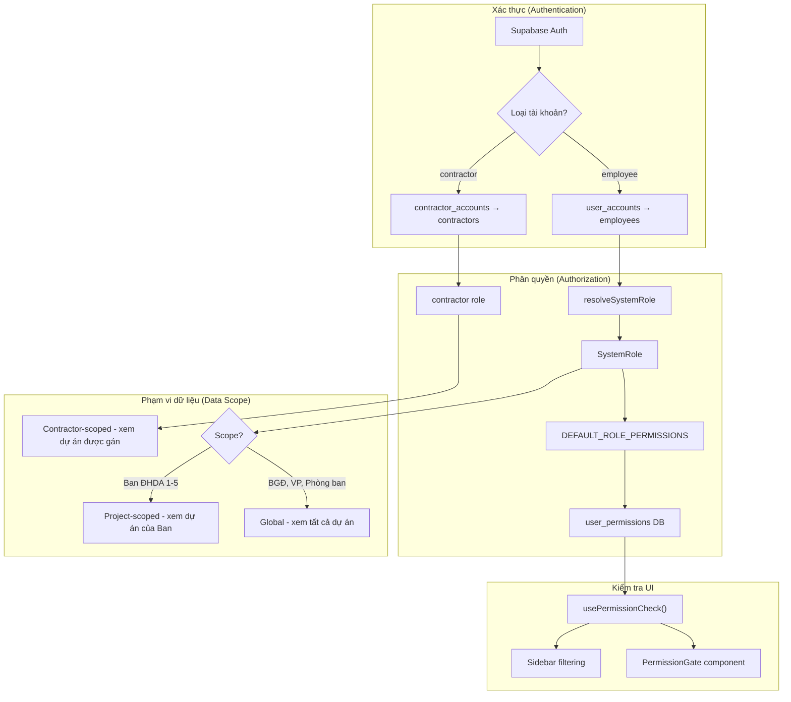
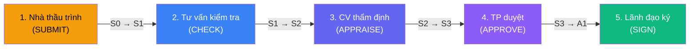
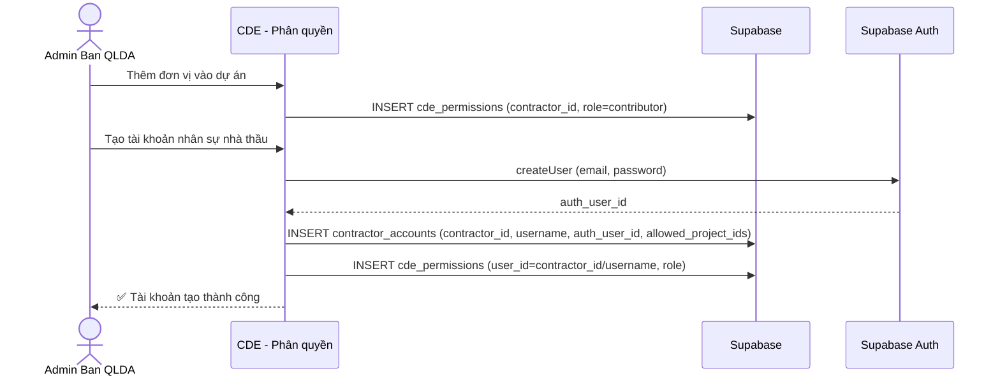

# Tài liệu Phân quyền Hệ thống QLDA ĐTXD ĐDCN — TP. Hồ Chí Minh

**Phiên bản:** 2.0  
**Ngày cập nhật:** 2026-03-13  
**Tác giả:** Ban QLDA ĐTXD ĐDCN TP.HCM  
**Trạng thái:** Đang áp dụng

---

## 1. Tổng quan

Hệ thống phân quyền được thiết kế theo nguyên tắc **Deny-by-default** (từ chối mặc định), đảm bảo mỗi người dùng chỉ truy cập được những chức năng và dữ liệu được cấp phép rõ ràng.

### 1.1 Nguyên tắc cốt lõi

| # | Nguyên tắc | Mô tả |
|---|-----------|-------|
| 1 | **Deny-by-default** | Mọi quyền đều bị từ chối cho đến khi được cấp một cách cụ thể |
| 2 | **Role-based** | Quyền được gán mặc định theo vai trò (system role) |
| 3 | **Customizable** | Admin có thể bật/tắt từng quyền cho từng cá nhân |
| 4 | **Scope-aware** | Dữ liệu được lọc theo phạm vi: toàn Ban, theo Ban ĐHDA, hoặc theo dự án nhà thầu |
| 5 | **Dual auth** | Hỗ trợ hai loại tài khoản: Nhân viên Ban & Nhà thầu |

### 1.2 Kiến trúc phân quyền



---

## 2. Vai trò hệ thống (System Roles)

Hệ thống có **9 vai trò**, chia thành 3 nhóm chính:

### 2.1 Nhóm Lãnh đạo (Global Scope)

| Vai trò | Code | Mô tả | Phạm vi dữ liệu |
|---------|------|-------|-----------------|
| Quản trị HT | `super_admin` | Toàn quyền hệ thống, bỏ qua mọi kiểm tra | Toàn bộ |
| Giám đốc | `director` | Phê duyệt, ký số, xem tất cả | Toàn bộ |
| Phó Giám đốc | `deputy_director` | Phê duyệt thay GĐ, xem tất cả | Toàn bộ |
| Kế toán Trưởng | `chief_accountant` | Quản lý thanh toán, xem tất cả | Toàn bộ |

### 2.2 Nhóm Chuyên môn (Global hoặc Project Scope)

| Vai trò | Code | Mô tả | Phạm vi dữ liệu |
|---------|------|-------|-----------------|
| Trưởng phòng / Trưởng ban | `dept_head` | Quản lý phòng/ban, duyệt trong phạm vi | Theo phòng ban |
| Phó phòng | `deputy_head` | Hỗ trợ trưởng phòng | Theo phòng ban |
| Chuyên viên / Kỹ sư | `specialist` | Tác nghiệp chính | Theo phòng ban |
| Nhân viên (hành chính) | `staff` | Nhập liệu, xem cơ bản | Theo phòng ban |

### 2.3 Nhóm Nhà thầu (Project Scope)

| Vai trò | Code | Mô tả | Phạm vi dữ liệu |
|---------|------|-------|-----------------|
| Nhà thầu | `contractor` | Nộp hồ sơ CDE, xem dự án được gán | Chỉ dự án được gán |

### 2.4 Quy tắc xác định vai trò

Vai trò được xác định tự động từ dữ liệu nhân sự theo thứ tự ưu tiên:

```
1. Role = 'Admin'            → super_admin
2. Role = 'Director'         → director
3. Role = 'DeputyDirector'   → deputy_director
4. Position chứa 'kế toán trưởng'     → chief_accountant
5. Position chứa 'giám đốc trung tâm' → dept_head
6. Position chứa 'chánh văn phòng'     → dept_head
7. Position chứa 'trưởng phòng/ban'    → dept_head
8. Position chứa 'phó phòng/VP'        → deputy_head
9. Position chứa 'nhân viên'           → staff
10. Role = 'Manager' (fallback)         → dept_head
11. Role = 'Staff' (fallback)           → specialist
12. Mặc định                            → specialist
```

---

## 3. Tài nguyên và Hành động

### 3.1 Danh sách tài nguyên (Resources) — 15 module

| # | Resource | Tên hiển thị | Menu Sidebar |
|---|----------|-------------|-------------|
| 1 | `dashboard` | Tổng quan | ✅ |
| 2 | `projects` | Dự án đầu tư | ✅ |
| 3 | `tasks` | Công việc | ✅ |
| 4 | `employees` | Nhân sự | ✅ |
| 5 | `contractors` | Nhà thầu | ✅ |
| 6 | `contracts` | Hợp đồng | ✅ |
| 7 | `payments` | Thanh toán | ✅ |
| 8 | `documents` | Hồ sơ tài liệu | ✅ |
| 9 | `cde` | Môi trường dữ liệu chung | ✅ |
| 10 | `legal_docs` | Văn bản pháp luật | ✅ |
| 11 | `reports` | Báo cáo | ✅ |
| 12 | `regulations` | Quy chế làm việc | ✅ |
| 13 | `admin_accounts` | Quản trị — Tài khoản | ✅ (Quản trị HT) |
| 14 | `admin_roles` | Quản trị — Phân quyền | Trong trang QT |
| 15 | `admin_audit` | Quản trị — Nhật ký HT | Trong trang QT |

### 3.2 Danh sách hành động (Actions) — 6 loại

| Action | Tên | Mô tả |
|--------|-----|-------|
| `view` | Xem | Xem danh sách và chi tiết |
| `create` | Thêm | Tạo mới bản ghi |
| `update` | Sửa | Chỉnh sửa bản ghi |
| `delete` | Xóa | Xóa bản ghi |
| `approve` | Duyệt | Phê duyệt / ký duyệt |
| `export` | Xuất | Xuất file Excel / PDF |

---

## 4. Ma trận phân quyền mặc định — NHÂN VIÊN BAN

> [!IMPORTANT]
> Bảng dưới đây là quyền **mặc định** khi khởi tạo. Admin có thể tùy chỉnh quyền cho từng cá nhân qua menu **Quản trị HT → Phân quyền**.

### 4.1 Quản trị hệ thống (`super_admin`)

| Resource | Xem | Thêm | Sửa | Xóa | Duyệt | Xuất |
|----------|:---:|:----:|:---:|:---:|:-----:|:----:|
| Tổng quan | ✅ | — | — | — | — | ✅ |
| Dự án | ✅ | ✅ | ✅ | ✅ | — | — |
| Công việc | ✅ | ✅ | ✅ | ✅ | — | — |
| Nhân sự | ✅ | ✅ | ✅ | ✅ | — | — |
| Nhà thầu | ✅ | ✅ | ✅ | — | — | — |
| Hợp đồng | ✅ | ✅ | ✅ | ✅ | ✅ | — |
| Thanh toán | ✅ | ✅ | ✅ | ✅ | ✅ | — |
| Hồ sơ tài liệu | ✅ | ✅ | ✅ | ✅ | — | — |
| CDE | ✅ | ✅ | ✅ | ✅ | ✅ | — |
| VB Pháp luật | ✅ | — | — | — | — | — |
| Báo cáo | ✅ | — | — | — | — | ✅ |
| Quy chế | ✅ | — | — | — | — | — |
| Tài khoản | ✅ | ✅ | ✅ | ✅ | — | — |
| Phân quyền | ✅ | ✅ | ✅ | ✅ | — | — |
| Nhật ký HT | ✅ | — | — | — | — | — |

> **Ghi chú:** Super Admin bỏ qua mọi kiểm tra quyền (bypass). Bảng trên chỉ để tham khảo.

### 4.2 Giám đốc (`director`)

| Resource | Xem | Thêm | Sửa | Xóa | Duyệt | Xuất |
|----------|:---:|:----:|:---:|:---:|:-----:|:----:|
| Tổng quan | ✅ | — | — | — | — | ✅ |
| Dự án | ✅ | — | — | — | — | — |
| Công việc | ✅ | ✅ | ✅ | — | — | — |
| Nhân sự | ✅ | — | — | — | — | — |
| Nhà thầu | ✅ | — | — | — | — | — |
| Hợp đồng | ✅ | — | — | — | ✅ | — |
| Thanh toán | ✅ | — | — | — | ✅ | — |
| Hồ sơ tài liệu | ✅ | — | — | — | — | — |
| CDE | ✅ | — | — | — | ✅ | — |
| VB Pháp luật | ✅ | — | — | — | — | — |
| Báo cáo | ✅ | — | — | — | — | ✅ |
| Quy chế | ✅ | — | — | — | — | — |
| Tài khoản | ✅ | — | — | — | — | — |
| Nhật ký HT | ✅ | — | — | — | — | — |

### 4.3 Phó Giám đốc (`deputy_director`)

| Resource | Xem | Thêm | Sửa | Xóa | Duyệt | Xuất |
|----------|:---:|:----:|:---:|:---:|:-----:|:----:|
| Tổng quan | ✅ | — | — | — | — | ✅ |
| Dự án | ✅ | — | — | — | — | — |
| Công việc | ✅ | ✅ | ✅ | — | — | — |
| Nhân sự | ✅ | — | — | — | — | — |
| Nhà thầu | ✅ | — | — | — | — | — |
| Hợp đồng | ✅ | — | — | — | ✅ | — |
| Thanh toán | ✅ | — | — | — | ✅ | — |
| Hồ sơ tài liệu | ✅ | — | — | — | — | — |
| CDE | ✅ | — | — | — | ✅ | — |
| VB Pháp luật | ✅ | — | — | — | — | — |
| Báo cáo | ✅ | — | — | — | — | ✅ |
| Quy chế | ✅ | — | — | — | — | — |

### 4.4 Kế toán Trưởng (`chief_accountant`)

| Resource | Xem | Thêm | Sửa | Xóa | Duyệt | Xuất |
|----------|:---:|:----:|:---:|:---:|:-----:|:----:|
| Tổng quan | ✅ | — | — | — | — | ✅ |
| Dự án | ✅ | — | — | — | — | — |
| Công việc | ✅ | — | — | — | — | — |
| Nhân sự | ✅ | — | — | — | — | — |
| Nhà thầu | ✅ | — | — | — | — | — |
| Hợp đồng | ✅ | — | — | — | — | — |
| **Thanh toán** | ✅ | ✅ | ✅ | ✅ | ✅ | — |
| Hồ sơ tài liệu | ✅ | — | — | — | — | — |
| CDE | ✅ | — | — | — | — | — |
| VB Pháp luật | ✅ | — | — | — | — | — |
| Báo cáo | ✅ | — | — | — | — | ✅ |
| Quy chế | ✅ | — | — | — | — | — |

> **Ghi chú:** Kế toán Trưởng có **toàn quyền** trên module **Thanh toán**.

### 4.5 Trưởng phòng / Trưởng ban ĐHDA (`dept_head`)

| Resource | Xem | Thêm | Sửa | Xóa | Duyệt | Xuất |
|----------|:---:|:----:|:---:|:---:|:-----:|:----:|
| Tổng quan | ✅ | — | — | — | — | — |
| Dự án | ✅ | ✅ | ✅ | — | — | — |
| Công việc | ✅ | ✅ | ✅ | ✅ | — | — |
| Nhân sự | ✅ | — | — | — | — | — |
| Nhà thầu | ✅ | ✅ | ✅ | — | — | — |
| Hợp đồng | ✅ | ✅ | ✅ | — | — | — |
| Thanh toán | ✅ | ✅ | ✅ | — | — | — |
| Hồ sơ tài liệu | ✅ | ✅ | ✅ | ✅ | — | — |
| CDE | ✅ | ✅ | ✅ | — | ✅ | — |
| VB Pháp luật | ✅ | — | — | — | — | — |
| Báo cáo | ✅ | — | — | — | — | ✅ |
| Quy chế | ✅ | — | — | — | — | — |

### 4.6 Phó phòng (`deputy_head`)

| Resource | Xem | Thêm | Sửa | Xóa | Duyệt | Xuất |
|----------|:---:|:----:|:---:|:---:|:-----:|:----:|
| Tổng quan | ✅ | — | — | — | — | — |
| Dự án | ✅ | — | ✅ | — | — | — |
| Công việc | ✅ | ✅ | ✅ | — | — | — |
| Nhân sự | ✅ | — | — | — | — | — |
| Nhà thầu | ✅ | ✅ | ✅ | — | — | — |
| Hợp đồng | ✅ | ✅ | ✅ | — | — | — |
| Thanh toán | ✅ | ✅ | ✅ | — | — | — |
| Hồ sơ tài liệu | ✅ | ✅ | ✅ | — | — | — |
| CDE | ✅ | ✅ | ✅ | — | — | — |
| VB Pháp luật | ✅ | — | — | — | — | — |
| Báo cáo | ✅ | — | — | — | — | ✅ |
| Quy chế | ✅ | — | — | — | — | — |

### 4.7 Chuyên viên / Kỹ sư (`specialist`)

| Resource | Xem | Thêm | Sửa | Xóa | Duyệt | Xuất |
|----------|:---:|:----:|:---:|:---:|:-----:|:----:|
| Tổng quan | ✅ | — | — | — | — | — |
| Dự án | ✅ | — | ✅ | — | — | — |
| Công việc | ✅ | ✅ | ✅ | — | — | — |
| Nhân sự | ✅ | — | — | — | — | — |
| Nhà thầu | ✅ | ✅ | ✅ | — | — | — |
| Hợp đồng | ✅ | ✅ | ✅ | — | — | — |
| Thanh toán | ✅ | ✅ | — | — | — | — |
| Hồ sơ tài liệu | ✅ | ✅ | ✅ | — | — | — |
| CDE | ✅ | ✅ | ✅ | — | — | — |
| VB Pháp luật | ✅ | — | — | — | — | — |
| Báo cáo | ✅ | — | — | — | — | — |
| Quy chế | ✅ | — | — | — | — | — |

### 4.8 Nhân viên hành chính (`staff`)

| Resource | Xem | Thêm | Sửa | Xóa | Duyệt | Xuất |
|----------|:---:|:----:|:---:|:---:|:-----:|:----:|
| Tổng quan | ✅ | — | — | — | — | — |
| Dự án | ✅ | — | — | — | — | — |
| Công việc | ✅ | — | — | — | — | — |
| Nhân sự | ✅ | — | — | — | — | — |
| Nhà thầu | ✅ | — | — | — | — | — |
| Hợp đồng | ✅ | — | — | — | — | — |
| Thanh toán | ✅ | — | — | — | — | — |
| Hồ sơ tài liệu | ✅ | ✅ | — | — | — | — |
| CDE | ✅ | — | — | — | — | — |
| VB Pháp luật | ✅ | — | — | — | — | — |
| Báo cáo | ✅ | — | — | — | — | — |
| Quy chế | ✅ | — | — | — | — | — |

> **Ghi chú:** Nhân viên hành chính chỉ có quyền xem toàn bộ + tải lên hồ sơ tài liệu.

---

## 5. Ma trận phân quyền — NHÀ THẦU

### 5.1 Quyền hệ thống (System-level)

Nhà thầu có quyền **rất hạn chế** trên hệ thống chính:

| Resource | Xem | Thêm | Sửa | Xóa | Duyệt | Xuất |
|----------|:---:|:----:|:---:|:---:|:-----:|:----:|
| Dự án | ✅ | — | — | — | — | — |
| CDE | ✅ | ✅ | — | — | — | — |
| **Tất cả module khác** | ❌ | ❌ | ❌ | ❌ | ❌ | ❌ |

> [!CAUTION]
> Nhà thầu **KHÔNG** được truy cập: Tổng quan, Công việc, Nhân sự, Hợp đồng, Thanh toán, Báo cáo, Quy chế, VB Pháp luật, và toàn bộ Quản trị hệ thống.

### 5.2 Menu Sidebar cho nhà thầu

Nhà thầu chỉ thấy **4 mục** trên sidebar (hardcoded):

| # | Mục menu | Icon | Ghi chú |
|---|---------|------|---------|
| 1 | Môi trường dữ liệu chung (CDE) | FolderTree | Module chính |
| 2 | Hợp đồng | FileText | Xem hợp đồng liên quan |
| 3 | Thanh toán | CreditCard | Xem thanh toán liên quan |
| 4 | Hồ sơ tài liệu | FileBox | Xem tài liệu liên quan |

> **Ghi chú:** Sidebar nhà thầu không gắn `resource` permission — nó là danh sách cố định. Tuy nhiên, quyền thực tế vẫn được kiểm tra ở cấp component.

### 5.3 Quyền CDE chi tiết cho nhà thầu

Trên module CDE, nhà thầu được phân quyền theo **5 mức vai trò CDE**:

| CDE Role | Code | Upload | Phê duyệt | Xóa | Quản trị | Container Access |
|----------|------|:------:|:---------:|:---:|:--------:|-----------------|
| Xem | `viewer` | ❌ | ❌ | ❌ | ❌ | WIP, SHARED, PUBLISHED |
| Nộp hồ sơ | `contributor` | ✅ | ❌ | ❌ | ❌ | WIP |
| Kiểm tra | `reviewer` | ✅ | ❌ | ❌ | ❌ | WIP, SHARED |
| Phê duyệt | `approver` | ✅ | ✅ | ❌ | ❌ | WIP, SHARED, PUBLISHED |
| Quản trị | `admin` | ✅ | ✅ | ✅ | ✅ | WIP, SHARED, PUBLISHED, ARCHIVED |

> **Mặc định:** Khi thêm nhà thầu vào dự án, họ sẽ nhận vai trò CDE `contributor` (nộp hồ sơ) với quyền upload vào container WIP.

### 5.4 Phạm vi dự án của nhà thầu

Nhà thầu chỉ nhìn thấy và tương tác được với **dự án cụ thể** mà họ được gán:

- Danh sách dự án được lưu trong `contractor_accounts.allowed_project_ids` (mảng UUID)
- Mỗi nhà thầu có thể được gán vào nhiều dự án
- Admin dự án quản lý danh sách này qua **CDE → Phân quyền tham gia dự án**

---

## 6. Phạm vi dữ liệu (Data Scope)

### 6.1 Scope toàn cục (Global View)

Các vai trò/phòng ban sau **xem được tất cả dự án**:

**Theo vai trò:**
- `super_admin`, `director`, `deputy_director`, `chief_accountant`

**Theo phòng ban:**
- Ban Giám đốc
- Văn phòng
- Phòng Kế hoạch – Đầu tư
- Phòng Tài chính – Kế toán
- Phòng Chính sách – Pháp chế
- Phòng Kỹ thuật – Chất lượng
- Trung tâm Dịch vụ tư vấn

### 6.2 Scope theo Ban ĐHDA (Project Scope)

Nhân viên thuộc **Ban Điều hành dự án 1–5** chỉ thấy dự án mà Ban mình quản lý:

| Phòng ban | Dự án hiển thị |
|-----------|---------------|
| Ban Điều hành dự án 1 | Dự án có `management_unit` = Ban ĐHDA 1 |
| Ban Điều hành dự án 2 | Dự án có `management_unit` = Ban ĐHDA 2 |
| Ban Điều hành dự án 3 | Dự án có `management_unit` = Ban ĐHDA 3 |
| Ban Điều hành dự án 4 | Dự án có `management_unit` = Ban ĐHDA 4 |
| Ban Điều hành dự án 5 | Dự án có `management_unit` = Ban ĐHDA 5 |

**Logic lọc:** Hook `useScopedProjects()` tự động lọc dữ liệu theo scope:
1. Kiểm tra vai trò/phòng ban → xác định global hay project-scoped
2. Nếu global → trả về tất cả dự án
3. Nếu project-scoped → lọc theo `management_unit` khớp với phòng ban người dùng
4. Nếu contractor → lọc theo `allowed_project_ids`

**Các module áp dụng scope:** Dự án, Công việc, Hợp đồng, Thanh toán, Hồ sơ tài liệu, CDE

### 6.3 Scope nhà thầu (Contractor Scope)  

Nhà thầu chỉ thấy dữ liệu thuộc dự án trong `allowed_project_ids`:

```
contractor_accounts.allowed_project_ids = ['project-uuid-1', 'project-uuid-2']
```

---

## 7. Quy trình duyệt CDE (CDE Workflow)

### 7.1 Các bước quy trình

Quy trình duyệt hồ sơ CDE theo ISO 19650 + NĐ 175/2024/NĐ-CP gồm **5 bước**:



### 7.2 Chi tiết từng bước

| # | Bước | Code | Người thực hiện | CDE Role | Status chuyển | Container |
|---|------|------|----------------|----------|--------------|-----------|
| 1 | Nhà thầu trình | `SUBMIT` | Nhà thầu | `contractor` | → S1 | WIP → WIP |
| 2 | Tư vấn kiểm tra | `CHECK` | Tư vấn giám sát | `consultant` | → S2 | WIP → SHARED |
| 3 | Chuyên viên thẩm định | `APPRAISE` | Chuyên viên Ban QLDA | `staff` | → S3 | SHARED → SHARED |
| 4 | Trưởng phòng duyệt | `APPROVE` | Trưởng phòng | `manager` | → A1 | SHARED → SHARED |
| 5 | Lãnh đạo ký số | `SIGN` | Lãnh đạo | `director` | → A1 | SHARED → PUBLISHED |

### 7.3 Mã trạng thái CDE (Status Codes)

| Code | Nhãn | Container | Màu |
|------|------|-----------|-----|
| S0 | WIP - Đang xử lý | WIP | 🟡 Amber |
| S1 | Tư vấn đang kiểm tra | SHARED | 🔵 Blue |
| S2 | Đang thẩm định | SHARED | 🟣 Indigo |
| S3 | Đang phê duyệt | SHARED | 🟣 Violet |
| A1 | Đã ký duyệt | PUBLISHED | 🟢 Emerald |
| A2 | Đã bàn giao | PUBLISHED | 🟢 Green |
| A3 | Quản lý tài sản | PUBLISHED | 🟢 Green dark |
| B1 | Lưu trữ | ARCHIVED | 🟣 Purple |

### 7.4 CDE Containers (ISO 19650)

| Container | Nhãn | Ý nghĩa |
|-----------|------|---------|
| **WIP** | Đang xử lý | Hồ sơ đang soạn/bổ sung, chưa trình duyệt |
| **SHARED** | Đang xét duyệt | Hồ sơ đã trình, đang qua các bước kiểm tra/duyệt |
| **PUBLISHED** | Đã phê duyệt | Hồ sơ đã được ký duyệt chính thức |
| **ARCHIVED** | Lưu trữ | Hồ sơ lưu trữ dài hạn |

---

## 8. Quản trị tài khoản nhà thầu

### 8.1 Quy trình tạo tài khoản



### 8.2 Thông tin tài khoản nhà thầu

| Trường | Bắt buộc | Mô tả |
|--------|:--------:|-------|
| `display_name` | ✅ | Họ tên nhân sự |
| `username` | ✅ | Tên đăng nhập |
| `password` | ✅ | Mật khẩu (≥6 ký tự) |
| `email` | ❌ | Email (nếu không có → `username@cde.local`) |
| `phone` | ❌ | Số điện thoại |
| `role` | ✅ | Vai trò CDE (viewer/contributor/reviewer/approver/admin) |

### 8.3 Cấu trúc dữ liệu

```
contractors (Đơn vị nhà thầu)
├── contractor_id (PK)
├── full_name
├── representative
└── contact_info

contractor_accounts (Tài khoản đăng nhập)
├── id (PK)
├── contractor_id (FK → contractors)
├── username
├── display_name
├── email
├── phone
├── auth_user_id (FK → auth.users)
├── is_active
├── allowed_project_ids (UUID[])
├── last_login
└── current_password

cde_permissions (Quyền CDE theo dự án)
├── id (PK)
├── project_id (FK → projects)
├── user_id (contractor_id hoặc contractor_id/username)
├── user_name
├── user_role (viewer | contributor | reviewer | approver | admin)
├── container_access (CDEContainerType[])
├── can_upload
├── can_approve
├── can_delete
├── can_manage
├── folder_restrictions (string[])
└── granted_by
```

---

## 9. Cơ chế kiểm tra quyền trong code

### 9.1 Hook `usePermissionCheck()`

Hook chính để kiểm tra quyền, hỗ trợ **impersonation** (giả lập vai trò):

```typescript
const { can, canOnProject, isGlobalScope, systemRole } = usePermissionCheck();

// Kiểm tra quyền cơ bản
can('contracts', 'create')     // → true/false

// Kiểm tra quyền theo dự án
canOnProject('view', 'Ban ĐHDA 1')  // → true nếu user thuộc Ban ĐHDA 1

// Kiểm tra phạm vi
isGlobalScope   // → true nếu user thấy tất cả dự án
systemRole      // → 'specialist', 'contractor', v.v.
```

### 9.2 Component `<PermissionGate>`

Ẩn/hiện UI dựa trên quyền:

```tsx
// Ẩn nút nếu không có quyền tạo hợp đồng
<PermissionGate resource="contracts" action="create">
  <button>Tạo hợp đồng mới</button>
</PermissionGate>

// Hiện nếu có BẤT KỲ quyền nào trong danh sách
<PermissionGate resource="cde" anyAction={['create', 'approve']}>
  <button>Thao tác CDE</button>
</PermissionGate>
```

### 9.3 Luồng kiểm tra quyền

```
1. User mở trang
2. Sidebar lọc menu → can(resource, 'view')
3. Component kiểm tra → <PermissionGate resource="X" action="Y">
4. Hook kiểm tra thứ tự:
   a. Super admin? → ALLOW
   b. Permissions chưa load? → DENY
   c. Có quyền trong user_permissions? → ALLOW/DENY
5. Data scope:
   a. isGlobalScope? → trả toàn bộ dự án
   b. Ban ĐHDA? → lọc theo management_unit
   c. Contractor? → lọc theo allowed_project_ids
```

---

## 10. Bảng tổng hợp so sánh Ban vs Nhà thầu

| Tiêu chí | Nhân viên Ban | Nhà thầu |
|----------|:-------------:|:--------:|
| Xác thực qua | `user_accounts` → `employees` | `contractor_accounts` → `contractors` |
| Số vai trò | 8 vai trò (super_admin → staff) | 1 vai trò (`contractor`) |
| Menu sidebar | 12–14 mục (theo quyền) | 4 mục cố định |
| Module truy cập | Tất cả (theo quyền) | Chỉ CDE, HĐ, TT, HSTL |
| Phạm vi dữ liệu | Global hoặc theo Ban ĐHDA | Chỉ dự án được gán |
| Quyền CDE | Theo system role | Theo CDE role (5 mức) |
| Quyền duyệt | Có (director, dept_head) | Không (trừ CDE role=approver) |
| Quyền quản trị | Có (super_admin) | Không |
| Impersonation | Có (admin có thể giả lập) | Có (admin giả lập nhà thầu) |
| Quản lý tài khoản | Admin → Quản trị HT | Admin → CDE → Phân quyền |

---

## Phụ lục A: Danh sách file code liên quan

| File | Mô tả |
|------|-------|
| `types/permission.types.ts` | Định nghĩa types, roles, resources, defaults |
| `hooks/usePermissionCheck.ts` | Hook kiểm tra quyền (impersonation-aware) |
| `hooks/useScopedProjects.ts` | Hook lọc dữ liệu theo scope |
| `services/PermissionService.ts` | CRUD operations trên user_permissions |
| `components/PermissionGate.tsx` | UI component gate |
| `context/AuthContext.tsx` | Authentication context (dual auth) |
| `layouts/Sidebar.tsx` | Menu sidebar (filtered by permission) |
| `features/settings/PermissionManager.tsx` | Admin UI quản lý quyền |
| `features/cde/components/CDEPermissionManager.tsx` | CDE permission UI |
| `features/cde/constants.ts` | CDE workflow, containers, status codes |
| `features/cde/types.ts` | CDE types (CDEPermRole, CDEPermission) |

## Phụ lục B: Bảng DB liên quan

| Table | Mô tả |
|-------|-------|
| `employees` | Danh sách nhân viên Ban |
| `user_accounts` | Tài khoản đăng nhập nhân viên |
| `contractors` | Danh sách đơn vị nhà thầu |
| `contractor_accounts` | Tài khoản đăng nhập nhà thầu |
| `user_permissions` | Ma trận quyền từng người (resource × actions) |
| `cde_permissions` | Quyền CDE theo dự án × người dùng |
